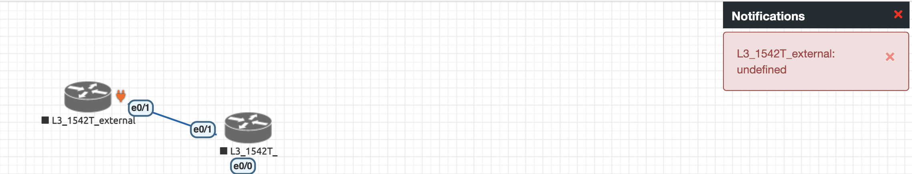
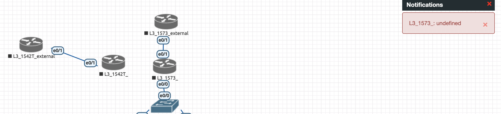

Не удалось завершить работу до конца из-за проблем с системой. 


<details>
  <summary>Хронология (можно в принципе пропустить):</summary>
После включения NAT `ip nat inside` маршрутизатор перестал отвечать в терминале, при попытке перезапустить его, крашнулась вся лаба. После перезапуска сервера маршрутизатор отказывался запускаться с undefined ошибкой. Спустя большое число попыток запусков маршрутизатор таки запустился и снова свалился при `ip nat inside`. Решив, что проблема с образом, я взял рабочий образ у одногруппника, но он так же не запускался с undefiend ошибкой. Скриншоты приложил ниже.
</details>






​	

​	Тем не менее, все кроме NAT сделать успел и даже сохранил конфиги, они соответственно лежат в configs.  Для настройки NAT не хватило:

_The closest router:_ 

```
int et0/0.10
	ip nat inside
int et0/0.20
	ip nat inside
int et0/1
	ip nat outside

access-list 10 permit 10.0.10.0 0.0.0.255
ip nat pool VLAN10_NAT_POOL 11.22.33.1 11.22.33.10 netmask 255.255.255.0
ip nat inside source list 10 pool VLAN10_NAT_POOL

access-list 20 permit 10.0.20.0 0.0.0.255
ip nat pool VLAN20_NAT_POOL 11.22.33.11 11.22.33.20 netmask 255.255.255.0
ip nat inside source list 20 pool VLAN20_NAT_POOL
```

_External router:_

```
int et0/1
	no shut
	ip address 11.22.33.99 255.255.255.0
```

DHCP реализован, надеюсь получить частичный балл за задание

